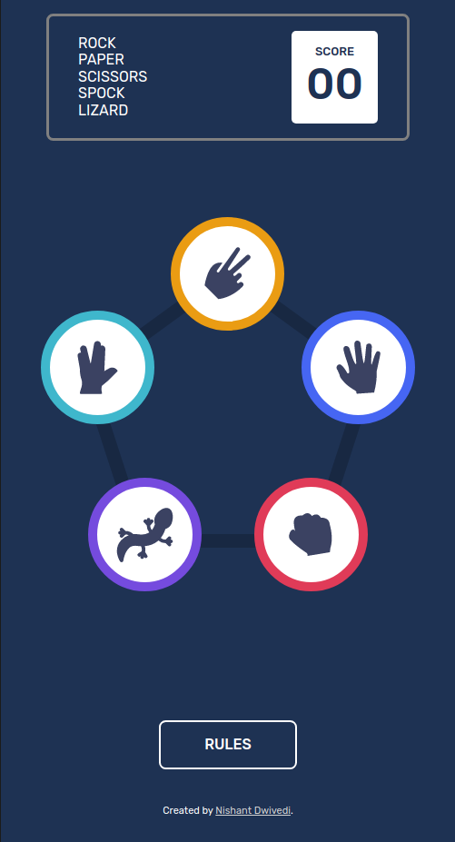
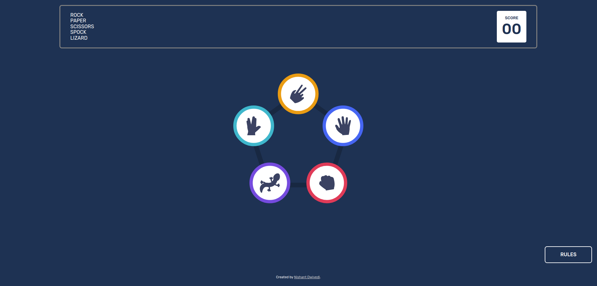

# Rock, Paper, Scissors, Spock & Lizard

This is an **advance** level challenge by [Frontend Mentor - Rock, Paper, Scissors, Spock & Lizard](https://www.frontendmentor.io/challenges/rock-paper-scissors-game-pTgwgvgH).

### Links

- Live Site URL: [Live Preview](https://quiet-vacherin-d396ca.netlify.app/)

### The challenge

Users should be able to:

- View the optimal layout for the game depending on their device's screen size
- Play Rock, Paper, Scissors against the computer
- **Bonus**: Play Rock, Paper, Scissors, Lizard, Spock against the computer _(optional)_

### Screenshots

### Built with

- Semantic HTML5 markup
- CSS custom properties
- Flexbox
- Mobile-first workflow

### What I learned

The CSS in this challenge was quite tricky. Especially the positioning aspect of  option elements. It took me a while to figure out how to position player options without breaking the layout. Eventually,   absolute positioning with some clever nesting did the trick for me. **The pentagon is not a background image(this is what i tried initially). It's an image with option elements positioned absolutely wrt to it.**

Javascript part wasn't easy either. I used a hash table (Js object) of winners (ex - rock: ["lizard", "scissors],..). This made my code cleaner.
Here's my **Logic: For every player/computer choice combination, where player's choice != computer's choice, check if a corresponding key-value pair exists in the winner object. If it does, the player wins, otherwise the computer wins.**

<!-- here's the winsAgainst object i used in JS:

const winsAgainst = {
    rock : ["lizard", "scissors"],
    paper : ["rock", "spock"],
    scissors : ["paper", "lizard"],
    lizard : ["spock", "paper"],
    spock : ["scissors", "rock"],
    }; 
    Here rock wins against lizard and scissors and so on..
 -->
